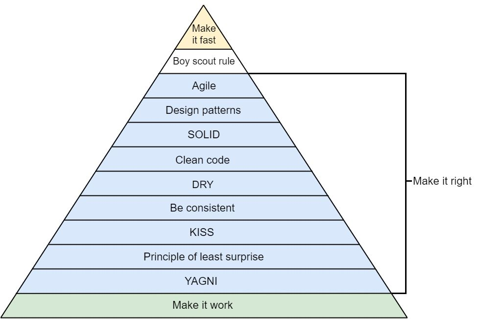
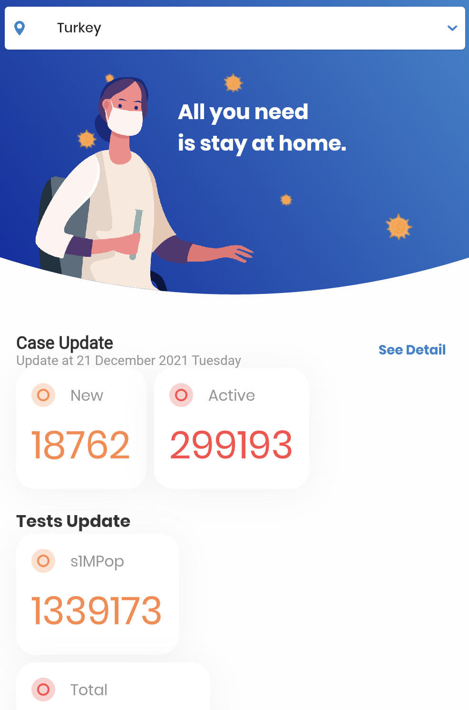
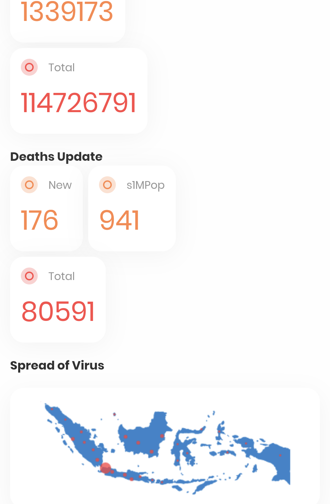
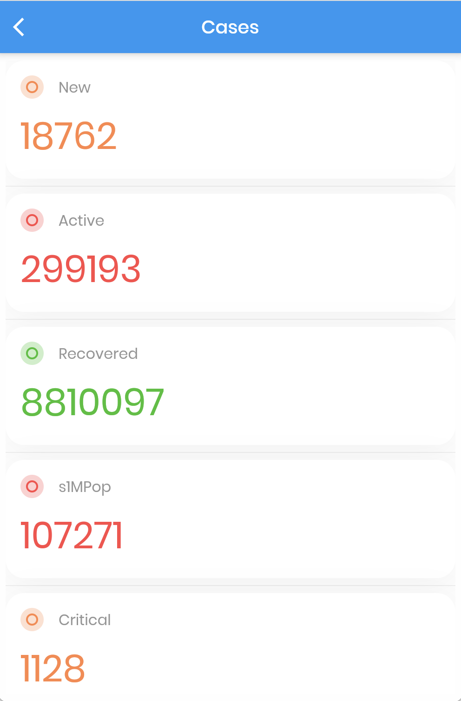
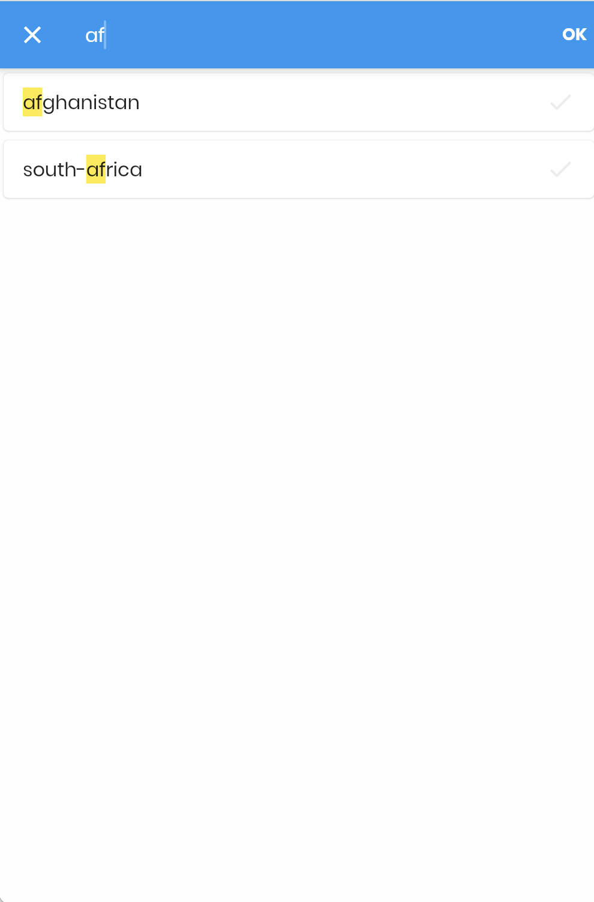

# Covid19Tracker

Sample Flutter Project for the Recruitment Process.

## Coding Sessions

| Order | Date      | Start    | End      | Description                                                                                            |
| ----- | --------- | -------- | -------- | ------------------------------------------------------------------------------------------------------ |
| 1.    | 18 Dec 21 | 10:40 AM | 11:00 AM | project requirements details added to the `ReadMe` file                                                |
| 2.    | 19 Dec 21 | 11:50 PM | 12:30 AM | folders and files of project createad                                                                  |
| 3.    | 20 Dec 21 | 11:50 AM | 4:00 PM  | project is coded without test and not intented to make codes perfect just I wanted to make app working |
| 4.    | 21 Dec 21 | 10:50 AM | 11:50 AM | some small cleaning and fixing                                                                         |
| 5.    | 21 Dec 21 | 12:15 PM | 1:30 PM  | writing unit tests                                                                                     |
| 6.    | 21 Dec 21 | 1:40 PM  | 2:00 PM  | some small cleaning and fixing                                                                         |
| 7.    | 21 Dec 21 | 2:20 PM  | 3:00 PM  | screenshots added to the readme file                                                                   |

## Sample Application

1. **Readability**: Class and method names should clearly show their intent and responsibility.
2. **Maintainability**
   1. **SOLID** Principles.
   2. ViewController should not know too much explicit knowledge about non-UI Classes.
   3. We do not like long methods or classes. Let alone huge ViewController classes.
3. **Scalability**:
   1. Your software should easily accommodate possible future requirement changes.
   2. If you are asked to change to XML-based API instead of JSON
   3. If you are asked to use a different persistent store (Core Data, SQLite, iCloud, FMDB)
   4. If you are asked to use different domains for listing or images, different URL configurations for listing or image.
4. **Testability**: Tests are great, but testability is more important.
   1. Please Unit Test all non-UI classes. Mocking, Stubbing, TDD if possible.
   2. Please handle all types of errors, which could occur.

- **Instructions**:
  1. The code should not contain any warnings or errors.
  2. The app should support all both OS (Android, iOS).
  3. You may use external libraries or tools for building or testing purposes. If you're using anything that's not written by you, mention it.

### Requirements:

1. As a user list the Country List Screen
   1. When the Country list screen is loaded
   2. Then, I should see the country list screen with the name
2. As a user at the Country List Screen,
   1. When I scroll to the top of the list
   2. Then I should see the search bar
3. As a user at the Country List Screen,
   1. When I focus the search bar
   2. Then I should be able search countries
4. As a user at the Country Detail Screen
   1. When the screen is loaded
   2. Then I should see the country statistics details (you can specify any detail)

### Rules;

- Please create a repo from GitHub or GitLab
- Share this repo with this email address: email@company-web-site and this must be a public repo
- You have the 3 days complete these steps (the weekend is not adding to the time limit.)
- We want to follow each commit, please commit each step

### API Details;

**API Documentation**: https://api-sports.io/documentation/covid-19/v1

**API Key**: `API_KEY`

**Base URL**: https://covid-193.p.rapidapi.com/

If you have an API Key problem when you try, you can create a new one from rapid API. And you can find more information about API Key on docs

**_You have to use only /countries and /statistics endpoints_**

If the API key doesn’t work you can follow the introduction on API documentation and you can create a custom one for yourself

### Solution Steps

**Sources**:

- [Flutter REST API Crash Course](https://courses.codewithandrea.com/p/flutter-rest-api-course-build-a-coronavirus-tracking-app) `Inspired to my api service`
- [json to dart](https://javiercbk.github.io/json_to_dart/) `Used to create my data models`
- [Covid-19-Flutter-UI](https://github.com/abuanwar072/Covid-19-Flutter-UI) `Used most of codes from there to create country detail page`
- [Scalable Folder Structure for Flutter Applications](https://medium.com/flutter-community/scalable-folder-structure-for-flutter-applications-183746bdc320)

## ScreenShots

---

---

---

